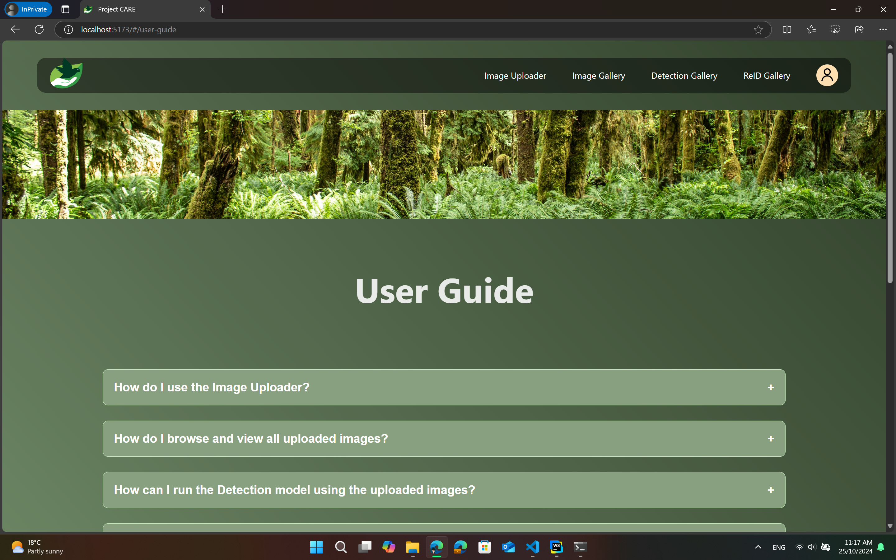
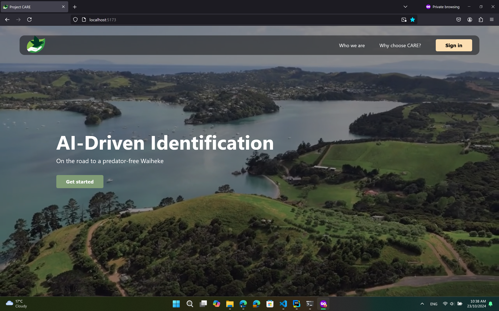
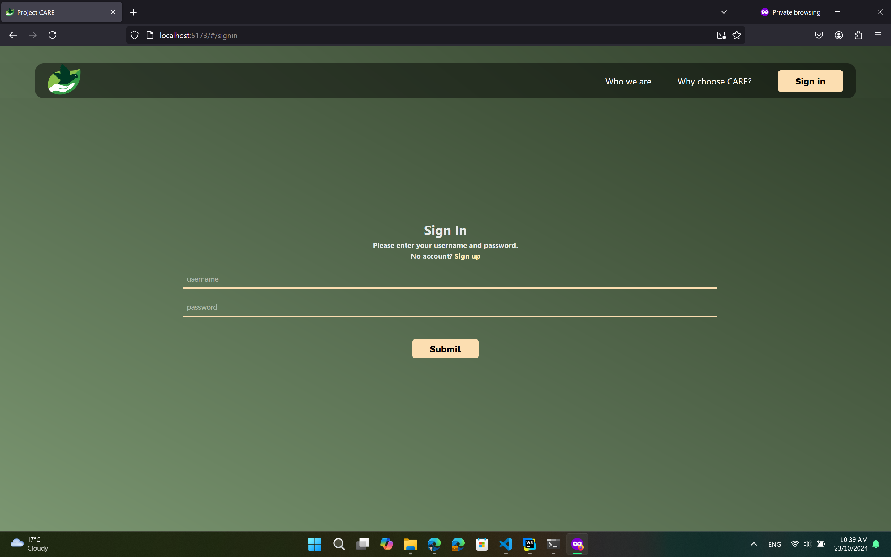
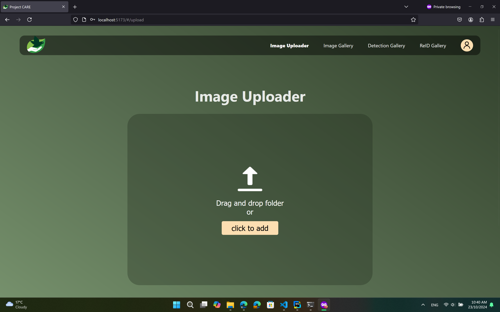
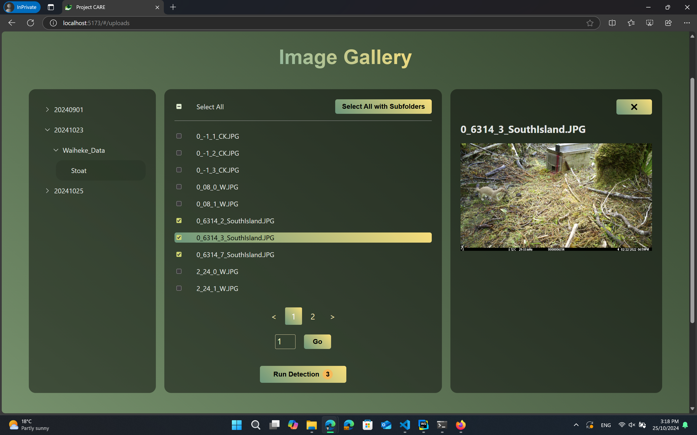
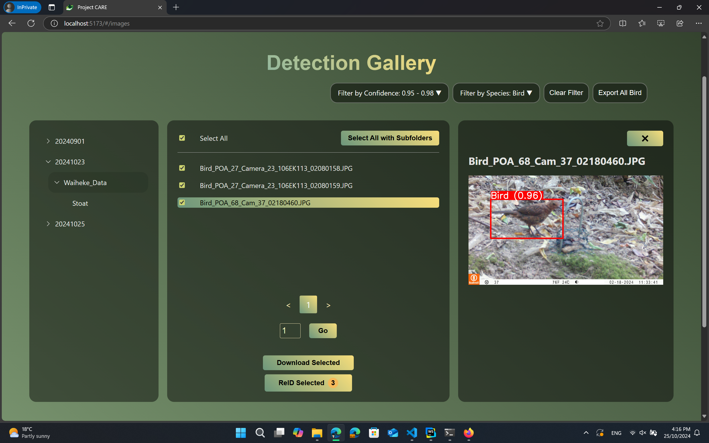
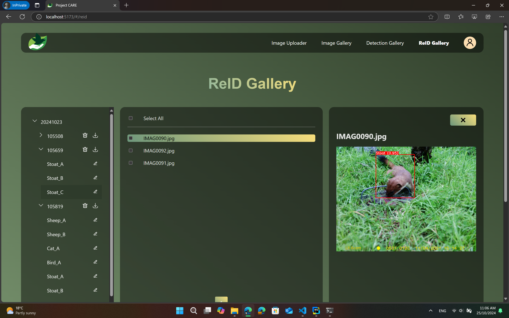

# CARE Web Platform: Advancing Wildlife Conservation through AI-Driven Animal Re-Identification

## Licence
CARE is licensed under the GNU Lesser General Public License v3.0.
See LICENSE for more information.

## Table of Contents
- [Project Description](#project-description)
- [Contributors](#contributors)
- [Collaborators & Acknowledgements](#collaborators--acknowledgements)
<!-- - [Helpful Links](#helpful-links) -->
<!-- - [Technologies Used](#technologies-used) -->
- [Install & Run (Easy Installation)](#install--run-easy-installation)
    - [Model Prerequisites](#model-prerequisites)
    - [Install Prerequisites](#install-prerequisites)
    - [Install CARE Web Platform](#install-care-web-platform)
    - [Run CARE Web Platform](#run-care-web-platform)
- [Default Credentials](#default-credentials)
- [User Guide](#user-guide)
- [Usage Examples](#usage-examples)
- [Screenshots](#screenshots)

## Project Description

New Zealand is home to some of the world’s most unique fauna, but these native species face significant threats from invasive pests. [One such predator is the stoat, which preys on the young of native birds.](https://www.doc.govt.nz/nature/pests-and-threats/animal-pests-and-threats/stoats) Our client has recognised this issue and tasked us with developing a web platform to assist in monitoring and controlling the presence of stoats on Waiheke Island. The platform leverages machine learning and artificial intelligence to accurately identify stoats and other animals captured in photos taken across the island. By utilising advanced image recognition algorithms, the platform can differentiate between various species, ensuring precise identification and effective monitoring. This innovative approach not only enhances the efficiency of pest control efforts but also contributes to the broader goal of preserving New Zealand’s unique biodiversity.

## Contributors
- [Yun Sing Koh](https://profiles.auckland.ac.nz/y-koh) (Professor in Computer Science, University of Auckland)
- [Di Zhao](https://www.linkedin.com/in/di-zhao-56869498/) (4th-Year PhD Student)
- [Yihao Wu](https://www.linkedin.com/in/yihao-wu-justin327) (1st-Year PhD Student)
- [Yuzhuo Li](https://www.linkedin.com/in/yuzhuo-li-a4a8b4245/) (Master Student)

## Collaborators & Acknowledgements
We would like to extend our sincere gratitude to Professor [Gillian Dobbie](https://profiles.auckland.ac.nz/g-dobbie), Dr. [Daniel Wilson](https://profiles.auckland.ac.nz/daniel-wilson), [Te Korowai o Waiheke](https://tekorowaiowaiheke.org/), and Capstone Team 39 for their invaluable contributions to this project. Their dedication, collaboration, and technical expertise have been instrumental in driving our work forward. We are also deeply grateful to Te Korowai o Waiheke for their support and partnership, whose commitment to environmental stewardship and community well-being continues to inspire and enrich our efforts. This project would not have been possible without the combined efforts of these outstanding partners.

<!-- ## Technologies Used

This application has been implemented with the following tech stack:

- Backend:  
    - Language: **JavaScript**  
    - Dependencies:  
        - **Archiver**: 7.0.1 (For creating ZIP archives)
        - **Axios**: 1.7.7 (Promise-based HTTP client)
        - **Bcrypt.js**: 2.4.3 (Password hashing library)
        - **Body Parser**: 1.20.2 (Middleware for parsing request bodies)
        - **Cookie Parser**: 1.4.6 (Middleware for cookie handling)
        - **CORS**: 2.8.5 (Middleware for Cross-Origin Resource Sharing)
        - **Dotenv**: 16.4.5 (Environment variable management)
        - **Express**: 4.19.2 (Web application framework)
        - **FS Extra**: 11.2.0 (File system utilities)
        - **JSON Web Token**: 9.0.2 (Token-based authentication)
        - **Mime Types**: 2.1.35 (MIME type mapping)
        - **Multer**: 1.4.5-lts.1 (Middleware for handling file uploads)
        - **Node Fetch**: 3.3.2 (HTTP requests for Node.js)
        - **Path**: 0.12.7 (Path utilities)
        - **Sequelize**: 6.37.3 (Promise-based ORM for SQL databases)
        - **SQLite3**: 5.1.7 (SQLite database driver)
        - **Unzipper**: 0.12.3 (Streaming unzip utility)
    - DevDependencies:  
        - **ESLint**: 9.9.0 (JavaScript linter)
        - **ESLint Plugin React**: 7.35.0 (ESLint rules for React)
        - **Globals**: 15.9.0 (Global variables for various environments)
        - **Nodemon**: 3.1.4 (Development utility for auto-restarting Node.js)

- Frontend:  
    - Language: **JavaScript** 
    - Dependencies:
        - **Auth0 for React**: 2.2.4 (Authentication library for React)
        - **Redux Toolkit**: 2.2.4 (State management toolkit for Redux)
        - **Classnames**: 2.5.1 (Utility for conditionally joining classNames)
        - **Clsx**: 2.1.0 (Utility for constructing classNames)
        - **Cypress**: 13.9.0 (End-to-end testing framework)
        - **Formik**: 2.4.5 (Form management library for React)
        - **JSZip**: 3.10.1 (Library for creating and reading ZIP files)
        - **LocalForage**: 1.10.0 (Offline storage library for web apps)
        - **Match Sorter**: 6.3.4 (Utility for sorting items with matching)
        - **Prop Types**: 15.8.1 (Runtime type checking for React props)
        - **React**: 18.2.0 (JavaScript library for building user interfaces)
        - **React DOM**: 18.2.0 (DOM-specific methods for React)
        - **React Image Gallery**: 1.3.0 (Responsive image gallery component)
        - **React Paginate**: 8.2.0 (Pagination component for React)
        - **React Redux**: 9.1.2 (Official React bindings for Redux)
        - **React Router DOM**: 6.22.3 (Routing for React applications)
        - **Redux Persist**: 6.0.0 (Persist and rehydrate Redux state)
        - **Sort By**: 0.0.2 (Utility for sorting arrays)
    - DevDependencies: 
        - **Type Definitions for React**: 18.2.64 (TypeScript definitions for React)
        - **Type Definitions for React DOM**: 18.2.21 (TypeScript definitions for React DOM)
        - **Vite React Plugin**: 4.2.1 (Vite plugin for React)
        - **ESLint**: 8.57.0 (JavaScript linter)
        - **ESLint Plugin React**: 7.34.0 (ESLint rules for React)
        - **ESLint Plugin React Hooks**: 4.6.0 (Linting rules for React hooks)
        - **ESLint Plugin React Refresh**: 0.4.5 (Support for React fast refresh)
        - **Vite**: 4.0.0 (Next-generation frontend build tool)

- AI Server:
    - Language: **Python**
    - Dependencies:
        - **Flask**: 3.0.3 (Micro web framework for Python)
        - **Python Dotenv**: 0.21.0 (Load environment variables from `.env` files) -->

## Install & Run
**Notice:** This is only available for Windows.

### Model Prerequisites
Please ensure you have the following models:

- **`best_50.pt`:** The Detection Model file. Place it in `<project directory>/backend/ai_server`.
- **`CARE_Traced.pt`:** The ReID Model file. Place it in `<project directory>/backend/ai_server`.

### Install Prerequisites
Before installation, please make sure you have Anaconda, Node.js, and Chrome installed in the default directory.

### Install CARE Web Platform
Run the following batch file to install the CARE Web Platform:  
`install_care_windows.bat`

This will automatically install all dependencies for the CARE Web Platform.

### Run CARE Web Platform
To start the CARE Web Platform, run:  
`start_care_windows.bat`

You will see three terminals representing the frontend, backend, and AI server status.   
If you accidentally close the browser window, you can access the CARE Web Platform at [http://localhost:5173/](http://localhost:5173/).  
To stop the CARE Web Platform, use `Ctrl+C` in each terminal.

## Default Credentials
Username: `admin`  
Password: `123456`

## User Guide
The CARE Web Platform comes with a comprehensive user guide, which can be found at the bottom of the platform.  

## Usage Examples
The following flowchart illustrates the basic usage of our application:  

Platform Architecture Chart

## Screenshots
Home Page  

Sign in Page  

Image Uploader  

Processing Pop-up

Uploaded Image Gallery

Detection Image Gallery  

ReID Image Gallery  

Profile Page  

Admin User Management Page  

